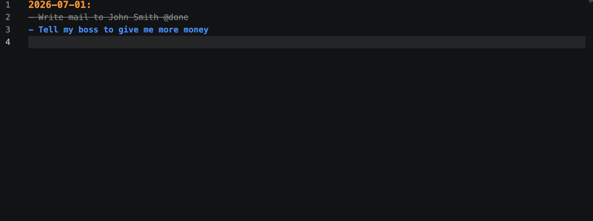

# Very Lightweight Todo-editor 

This todo editor lets you note, organisze and finalize your todos easily and quickly. I am using a version of this editor as an eclipse plugin for over years now and I am very satisfied. Therefore I replicated the most used features in this extension. 

## Features

This is a very lightweight editor with the following features:
1. Highlight a line ending with ":" in orange (I usually use this for the specific day)
2. Highlight a line starting with "-" in blue (this is usually a todo)
3. Support code completion for marking a todo as DONE
4. Files needs to have the ending ".todo" to be considered as a todo file. 

That's it. The editor does not have any additional intelligence. Nice thing is that you can check in your todo-files and can use them on more than one machine easily. No magic, no hazzle. 

## Known Issues

none

## Release Notes

### 0.0.1

Initial release of todo-editor with basic feature set. Not tested yet in day to day work. 

---

## Following extension guidelines

Ensure that you've read through the extensions guidelines and follow the best practices for creating your extension.

* [Extension Guidelines](https://code.visualstudio.com/api/references/extension-guidelines)

## For more information

* [Visual Studio Code's Markdown Support](http://code.visualstudio.com/docs/languages/markdown)
* [Markdown Syntax Reference](https://help.github.com/articles/markdown-basics/)

**Enjoy!**
